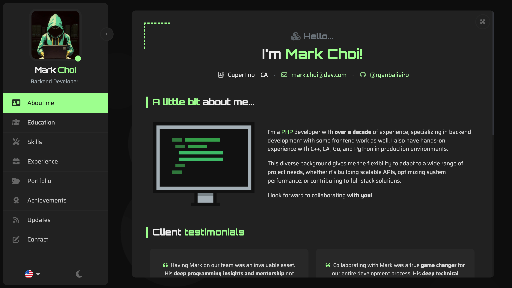

# [ React Portfolio](https://ryanbalieiro.github.io/react-portfolio-template/) by Ryan Balieiro

A sleek, futuristic portfolio template for developers – built with **React** and **Bootstrap 5**.


Key features:
- Lightweight and fully responsive.
- Adapts perfectly to mobile screens.
- Multi-language support included.
- Comes with both dark and light theme options.
- A variety of components to highlight your work experience, education, skills, portfolio, and more.
- Uses **Vite** for packaging.
- Emails with **EmailJS** - no backend needed!

## Live Preview

Here's a list of live versions of the template:

| #     | Version             | Description                                             | URL                                                                         |
|-------|---------------------|---------------------------------------------------------|-----------------------------------------------------------------------------|
| 🟢    | Mark Choi (default) | Latest deployment of the template here on GitHub pages. | [Preview](https://ryanbalieiro.github.io/react-portfolio-template/)         |

## Layout and concept

### 1. Base layout
The layout uses a fixed central view with a left sidebar, adjusting perfectly across various monitor resolutions, from 4:3 to ultra-wide.



### 2. Desktop Screenshots
The main view transitions smoothly when a new page is selected from the sidebar, giving a page-flipping effect. The sidebar is also toggleable, allowing the content area to expand for a larger viewing space.


### 3. Mobile Screenshots
On mobile, the layout groups the portfolio sections into categories and transforms into a tabbed interface with a bottom navigation.


## Getting Started

1. Clone the repo:
```
git clone https://github.com/ryanbalieiro/react-portfolio-template
```

2. Go to the project's root folder and use npm to install all required components:
```
npm install
```

3. Launch the project in developer mode:
```
npm run dev
```

## Customization Tutorial

Follow this step-by-step guide to customize the template with your own content and styles. You can either read the documentation or watch the interactive video tutorials:

| #    | Title                       | Docs                                                                    | Watch on YouTube     |
|------|-----------------------------|-------------------------------------------------------------------------|----------------------|
| 1    | Setting up the project      | [See Docs](./docs/tutorials/TUTORIAL_01_SETTING_UP_THE_PROJECT.md)      | [Coming Soon...](#)  | 
| 2    | Configuring settings.json   | [See Docs](./docs/tutorials/TUTORIAL_02_CONFIGURING_SETTINGS_JSON.md)   | [Coming Soon...](#)  |  
| 3    | Titles and Colors           | [See Docs](./docs/tutorials/TUTORIAL_03_TITLES_AND_COLORS.md)           | [Coming Soon...](#)  |
| 4    | Profile and Strings         | [See Docs](./docs/tutorials/TUTORIAL_04_PROFILE_AND_STRINGS.md)         | [Coming Soon...](#)  |
| 5    | Categories and Sections     | [See Docs](./docs/tutorials/TUTORIAL_05_CATEGORIES_AND_SECTIONS.md)     | [Coming Soon...](#)  | 
| 6    | Section Titles              | [See Docs](./docs/tutorials/TUTORIAL_06_SECTION_TITLES.md)              | [Coming Soon...](#)  |
| 7    | Section Articles            | [See Docs](./docs/tutorials/TUTORIAL_07_SECTION_ARTICLES.md)            | [Coming Soon...](#)  |
| 8    | ArticleInlineList           | [See Docs](./docs/tutorials/TUTORIAL_08_ARTICLE_INLINE_LIST.md)         | [Coming Soon...](#)  |
| 9    | ArticleText                 | [See Docs](./docs/tutorials/TUTORIAL_09_ARTICLE_TEXTS.md)               | [Coming Soon...](#)  |
| 10   | ArticleCards                | [See Docs](./docs/tutorials/TUTORIAL_10_ARTICLE_CARDS.md)               | [Coming Soon...](#)  |
| 11   | ArticleSkills               | [See Docs](./docs/tutorials/TUTORIAL_11_ARTICLE_SKILLS.md)              | [Coming Soon...](#)  |
| 12   | ArticleTimeline             | [See Docs](./docs/tutorials/TUTORIAL_12_ARTICLE_TIMELINE.md)            | [Coming Soon...](#)  |
| 13   | ArticleStack                | [See Docs](./docs/tutorials/TUTORIAL_13_ARTICLE_STACK.md)               | [Coming Soon...](#)  |
| 14   | ArticlePortfolio            | [See Docs](./docs/tutorials/TUTORIAL_14_ARTICLE_PORTFOLIO.md)           | [Coming Soon...](#)  |
| 15   | ArticleTestimonials         | [See Docs](./docs/tutorials/TUTORIAL_15_ARTICLE_TESTIMONIALS.md)        | [Coming Soon...](#)  |
| 16   | ArticleInfoList             | [See Docs](./docs/tutorials/TUTORIAL_16_ARTICLE_INFO_LIST.md)           | [Coming Soon...](#)  |
| 17   | ArticleFacts                | [See Docs](./docs/tutorials/TUTORIAL_17_ARTICLE_FACTS.md)               | [Coming Soon...](#)  |
| 18   | ArticleThreads              | [See Docs](./docs/tutorials/TUTORIAL_18_ARTICLE_THREADS.md)             | [Coming Soon...](#)  |
| 19   | ArticleContactForm          | [See Docs](./docs/tutorials/TUTORIAL_19_ARTICLE_CONTACT_FORM.md)        | [Coming Soon...](#)  |
| 20   | Categorizing article items  | [See Docs](./docs/tutorials/TUTORIAL_20_CATEGORIZING_ARTICLE_ITEMS.md)  | [Coming Soon...](#)  |
| 21   | Deploying for production    | [See Docs](./docs/tutorials/TUTORIAL_21_DEPLOYING_FOR_PRODUCTION.md)    | [Coming Soon...](#)  |

### Bonus Tutorials

Follow these additional tutorials to further enhance your portfolio with advanced features:

| #    | Title                            | Docs                                                                               | Watch                |
|------|----------------------------------|------------------------------------------------------------------------------------|----------------------|
| 22   | Creating your own custom article | [See Docs](./docs/tutorials/TUTORIAL_22_BONUS_CREATING_YOUR_OWN_CUSTOM_ARTICLE.md) | [Coming Soon...](#)  |

## About

This template was created by and is maintained by **[Ryan Balieiro](https://ryanbalieiro.com/)**.

It's based on the **[React](https://reactjs.org/)** framework created by Jordan Walke, and the **[Bootstrap](https://getbootstrap.com/)** framework created by Mark Otto and Jacob Thorton.

Additional frameworks and plugins used include:
- **Smooth Scrollbar**: A customizable scrollbar plugin.
- **Swiper**: A powerful library for creating touch sliders.
- **EmailJS**: A free service that allows you to send emails using JavaScript.
- **Font Awesome**: A library of free vector icons.

## Copyright and License

Code released under the [MIT](https://github.com/StartBootstrap/startbootstrap-agency/blob/master/LICENSE) license, providing complete freedom for utilization. Feel free to enhance and adapt it to suit your needs.

Oh... and if you like this template, don't forget to **give it a ⭐** :)